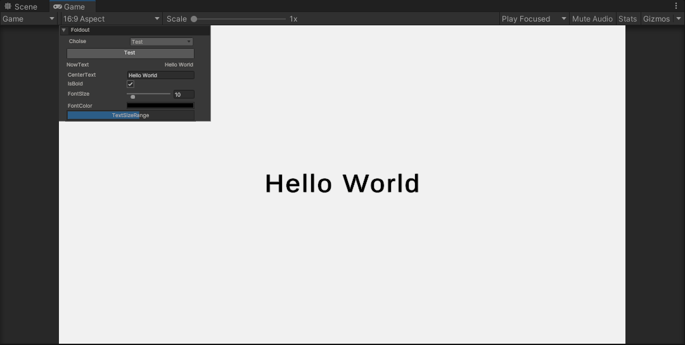

# DebugToolkit

Unity UItoolkit extensions for Rapid prototyping/development.



## Features
- UIToolkit for Debug
- Simple to use
- Same UI design as UnityEditor
- Higher performance than IMGUI

## Installation

### Install via OpenUPM

The package is available on the [openupm registry](https://openupm.com/). It's recommended to install it via [openupm-cli](https://github.com/openupm/openupm-cli).

```
openupm add com.went-bye.uitoolkit
```

### Install via git URL

Add following lines to the `dependencies` section of the `Packages/manifest.json`.

```
"com.went-bye.uitoolkit": "https://github.com/went-bye/DebigToolkit.git"
```

## Quick Start

```csharp
public class Sandbox : MonoBehaviour
{
    DebugToolkit _toolkit;

    void OnEnable()
    {
        _toolkit = gameObject.AddComponent<DebugToolkit>();
        _toolkit.AddButton("Button",()=>Debug.Log("Hello World"));
    }

}
```

## WebGL Sample
https://went5.github.io/DebugToolkit/

## RoadMap
https://trello.com/b/OgXdodjm/debugtoolkit
